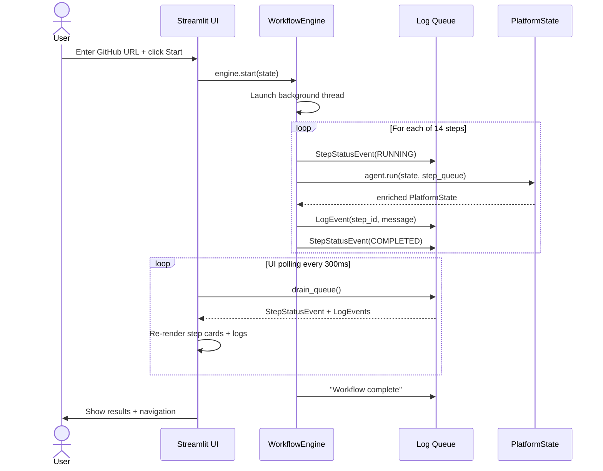
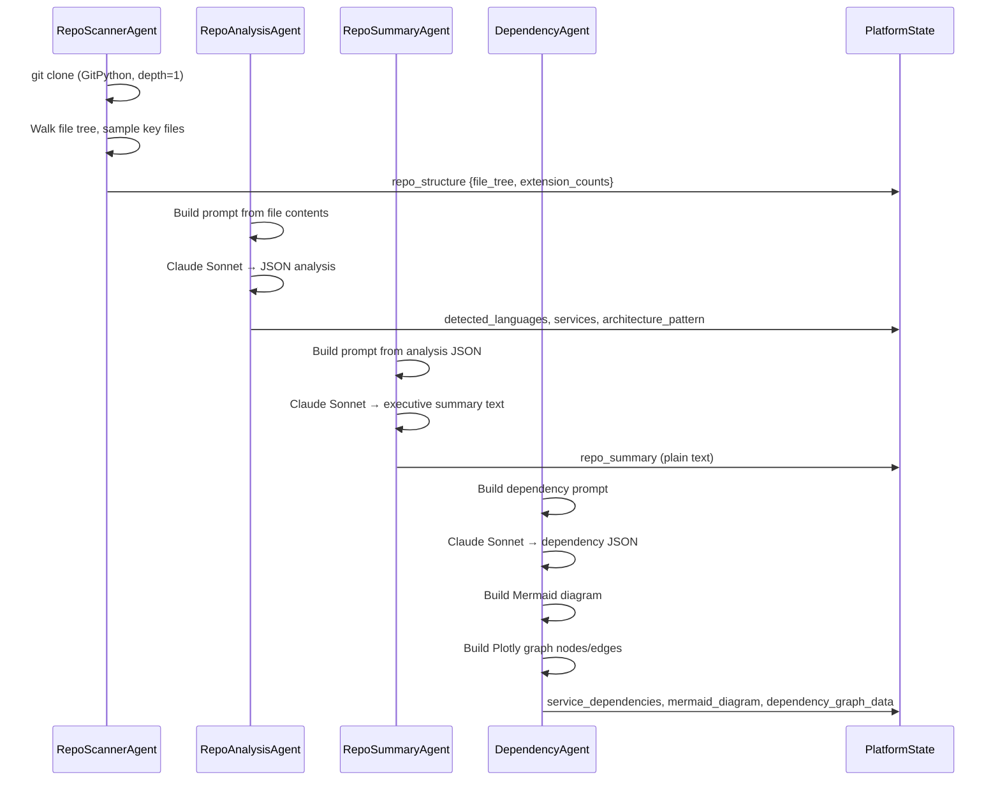
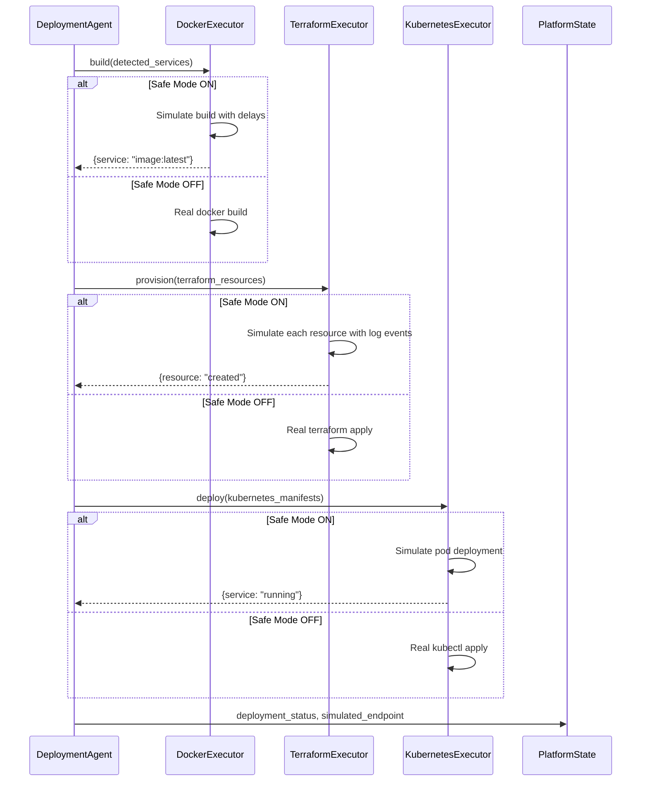
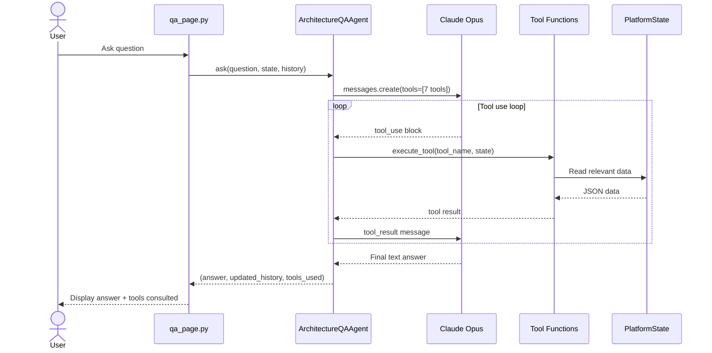

# AI Cloud Migration Assistant

An AI-powered internal developer platform that analyzes a GitHub repository and automatically designs, modernizes, and simulates deployment of a cloud architecture. 
---

## Table of Contents

- [Overview](#overview)
- [Architecture](#architecture)
- [Agent Pipeline](#agent-pipeline)
- [Sequence Diagrams](#sequence-diagrams)
- [Project Structure](#project-structure)
- [How State is Stored](#how-state-is-stored)
- [UI Pages](#ui-pages)
- [Technology Stack](#technology-stack)
- [Getting Started](#getting-started)
- [Safe Mode](#safe-mode)
- [Cloud Selection Logic](#cloud-selection-logic)

---

## Overview

AI Cloud Migration Assistant uses a **multi-agent architecture** where 11 specialized AI agents work in sequence to:

1. Clone and scan a GitHub repository
2. Analyze its architecture and dependencies
3. Generate a cloud modernization plan
4. Produce Kubernetes manifests and Terraform infrastructure code
5. Simulate a full cloud deployment
6. Estimate monthly and annual costs
7. Answer follow-up questions via an AI Q&A agent

The system runs entirely with **Safe Mode** enabled by default — no real cloud resources are ever created during demos. (Due to Cost Implications), however the Agent can also trigger Terraform and create the cloud resources if needed. 

---

## Architecture

```mermaid
flowchart TD
    subgraph UI["🖥️ Streamlit UI (app.py)"]
        direction LR
        D["🎯 Dashboard"]
        DV["🚀 Deployment"]
        QA["💬 Q&A"]
        IV["🏛️ Infrastructure"]
        CV["💰 Cost"]
    end

    subgraph Core["⚙️ Core Services"]
        WE["WorkflowEngine\n(Background Thread)"]
        LQ["Log Queue\n(queue.Queue)"]
        PS["PlatformState\n(Pydantic · session_state)"]
    end

    subgraph QAService["🤖 Q&A Agent"]
        QAA["ArchitectureQAAgent\nClaude Opus + 7 Tools"]
    end

    subgraph Pipeline["🔄 14-Step Agent Pipeline"]
        direction LR
        subgraph Analysis["📊 Analysis  (Steps 1–6)"]
            S1["1 · RepoScanner\nSonnet"]
            S2["2 · RepoAnalysis\nSonnet"]
            S3["3 · RepoSummary\nSonnet"]
            S4["4 · Dependency\nSonnet"]
            S5["5 · Infrastructure\nSonnet"]
            S6["6 · Modernization\n⭐ Opus"]
        end
        subgraph Generation["⚡ Generation  (Steps 7–9)"]
            S7["7 · CloudSelection\nLogic"]
            S8["8 · Kubernetes\nSonnet"]
            S9["9 · Terraform\nSonnet"]
        end
        subgraph Deployment["🚀 Deployment  (Steps 10–14)"]
            S10["10 · Bundle\nExecutor"]
            S11["11 · Provision\nExecutor"]
            S12["12 · Deploy\nExecutor"]
            S13["13 · Validate\nExecutor"]
            S14["14 · Cost\nSonnet"]
        end
        Analysis --> Generation --> Deployment
    end

    D -->|start| WE
    WE --> LQ
    LQ -->|poll 300ms| D
    WE --> Pipeline
    Pipeline --> PS
    PS --> DV & IV & CV
    QA --> QAAService
    QAService --> PS

    style S6 fill:#6b46c1,color:#fff
    style QAA fill:#6b46c1,color:#fff
    style UI fill:#0d2137,color:#e2e8f0,stroke:#00d4ff
    style Core fill:#0a1628,color:#e2e8f0,stroke:#30363d
    style Pipeline fill:#0a1628,color:#e2e8f0,stroke:#30363d
    style Analysis fill:#0d1f3c,color:#e2e8f0,stroke:#2d3a6b
    style Generation fill:#0d1f3c,color:#e2e8f0,stroke:#2d3a6b
    style Deployment fill:#0d1f3c,color:#e2e8f0,stroke:#2d3a6b
    style QAService fill:#1a0d2e,color:#e2e8f0,stroke:#6b46c1
```



---

## Agent Pipeline

| Step | Agent | Model | Input | Output |
|---|---|---|---|---|
| 1 | RepoScannerAgent | Sonnet | GitHub URL | File tree, extension counts |
| 2 | RepoAnalysisAgent | Sonnet | File tree + key file contents | Architecture pattern, languages, services |
| 3 | RepoSummaryAgent | Sonnet | Repo analysis JSON | Executive architecture summary (text) |
| 4 | DependencyAgent | Sonnet | Analysis + directory structure | Service dependency map, Mermaid diagram, Plotly graph data |
| 5 | InfrastructureAgent | Sonnet | Dependency map + cloud provider | List of required cloud resources |
| 6 | ModernizationAgent | **Opus** | Full analysis + summary | Recommendations, migration phases, risks, quick wins |
| 7 | CloudSelectionAgent | Logic | User card selection | `cloud_provider = "AWS"` or `"GCP"` |
| 8 | KubernetesAgent | Sonnet | Services + dependencies + cloud | K8s Deployment/Service/Ingress YAML per service |
| 9 | TerraformAgent | Sonnet | Infrastructure resources + cloud | Raw Terraform HCL (provider, networking, cluster, DB, cache) |
| 10-13 | DeploymentAgent | Executors | K8s manifests + Terraform resources | Docker builds, Terraform provisioning, K8s deploy, endpoint |
| 14 | CostEstimationAgent | Sonnet | Resources + cloud + services | Monthly/annual cost breakdown with line items |
| Q&A | ArchitectureQAAgent | **Opus** | User question + 7 tools | Contextual answers using architecture data |

---

## Sequence Diagrams

### Main Workflow Sequence



### Repository Analysis Sequence



### Deployment Simulation Sequence



### Architecture Q&A Sequence (Agent SDK)



---

## Project Structure

```
ai-platform-architect/
│
├── app.py                          # Entry point: Streamlit config, CSS, sidebar nav, page routing
│
├── models/
│   └── platform_state.py          # PlatformState Pydantic model — shared between all agents
│                                  # WORKFLOW_STEPS list with agent names and model assignments
│
├── agents/
│   ├── repo_scanner_agent.py      # Step 1: Clone repo via GitPython, build file tree
│   ├── repo_analysis_agent.py     # Step 2: Analyze file contents → architecture JSON
│   ├── repo_summary_agent.py      # Step 3: Generate executive summary text
│   ├── dependency_agent.py        # Step 4: Build dependency map + Mermaid + Plotly data
│   ├── infrastructure_agent.py    # Step 5: Identify cloud resources needed
│   ├── modernization_agent.py     # Step 6: Claude Opus — modernization recommendations
│   ├── cloud_selection_agent.py   # Step 7: Confirm user-selected cloud provider (AWS or GCP)
│   ├── kubernetes_agent.py        # Step 8: Generate K8s YAML manifests
│   ├── terraform_agent.py         # Step 9: Generate raw Terraform HCL
│   ├── deployment_agent.py        # Steps 10-13: Orchestrate Docker/Terraform/K8s executors
│   ├── cost_estimation_agent.py   # Step 14: Generate cost breakdown
│   └── architecture_qa_agent.py   # Page 3: Agent SDK orchestrator with 7 tools
│
├── services/
│   ├── repo_cloner.py             # GitPython clone + file tree builder
│   ├── workflow_engine.py         # Background thread + _StepQueue log tagger
│   └── terraform_executor.py      # TerraformExecutor + DockerExecutor + KubernetesExecutor
│                                  # All support Safe Mode (simulated) and Live mode
│
├── ui/
│   ├── dashboard.py               # Page 1: Input panel + workflow pipeline with polling loop
│   ├── workflow_visualizer.py     # Step cards with agent names, per-step logs, outcome summaries
│   ├── deployment_view.py         # Page 2: Deployment terminal output + pod table
│   ├── qa_page.py                 # Page 3: Chat interface powered by ArchitectureQAAgent
│   ├── architecture_view.py       # Page 4: Mermaid diagram, Plotly graph, K8s YAML, Terraform, Modernization
│   └── cost_view.py               # Page 5: Cost metrics, dataframe table, Plotly pie chart
│
├── utils/
│   ├── claude_client.py           # Anthropic SDK wrapper — model routing (Sonnet vs Opus)
│   ├── logger.py                  # LogEvent + StepStatusEvent Pydantic models
│   ├── diagram_generator.py       # Mermaid syntax builder + Plotly graph data converter
│   └── json_parser.py             # Robust JSON extractor with 4 fallback strategies
│
├── .streamlit/
│   ├── config.toml                # Streamlit theme and server config
│   └── credentials.toml           # Skip email prompt
│
├── requirements.txt
├── .env                           # ANTHROPIC_API_KEY (not committed)
└── .env.example
```

---

## How State is Stored

There is **no database**. All state lives in Streamlit's `st.session_state` in-memory during the session.

### PlatformState fields

| Field | Type | Set by |
|---|---|---|
| `repo_url` | str | User input |
| `safe_mode` | bool | User input |
| `cloud_provider` | str | CloudSelectionAgent |
| `step_statuses` | dict[str, str] | WorkflowEngine |
| `repo_structure` | dict | RepoScannerAgent |
| `repo_analysis` | dict | RepoAnalysisAgent |
| `repo_summary` | str | RepoSummaryAgent |
| `service_dependencies` | dict | DependencyAgent |
| `mermaid_diagram` | str | DependencyAgent |
| `dependency_graph_data` | dict | DependencyAgent |
| `infrastructure_plan` | dict | InfrastructureAgent |
| `terraform_resources` | list | InfrastructureAgent |
| `modernization_plan` | dict | ModernizationAgent |
| `kubernetes_manifests` | dict | KubernetesAgent |
| `terraform_code` | str | TerraformAgent |
| `deployment_status` | dict | DeploymentAgent |
| `simulated_endpoint` | str | DeploymentAgent |
| `cost_estimation` | dict | CostEstimationAgent |

### Per-step logs

Step-level logs are stored in `st.session_state.step_logs` — a dict keyed by `step_id`:

```python
{
  "scan":   [LogEvent(...), LogEvent(...)],
  "analyze": [LogEvent(...), ...],
  ...
}
```

The `_StepQueue` wrapper in `WorkflowEngine` automatically tags every `LogEvent` with the `step_id` of the currently running agent before putting it on the queue.

### Downloading artifacts

Every completed step exposes download buttons directly on the dashboard card:

| Step | Downloadable artifact |
|---|---|
| Summarize | `architecture_summary.txt` |
| Dependencies | `architecture_diagram.mmd`, `dependency_graph.json` |
| Infrastructure | `infrastructure_plan.json` |
| Modernization | `modernization_plan.json` |
| Kubernetes | `k8s_manifests.yaml` |
| Terraform | `main.tf` |
| Cost | `cost_estimation.json` |

---

## UI Pages

| Page | Description |
|---|---|
| 1. Architecture Workflow | 14-step animated pipeline with per-step agent name, logs, outcomes, and downloads |
| 2. Deployment Simulation | Infrastructure provisioning output, pod status table, simulated endpoint |
| 3. Architecture Q&A | Chat powered by Claude Opus + 7 architecture tools (Agent SDK) |
| 4. Generated Infrastructure | Mermaid diagram · Plotly dependency graph · K8s YAML · Terraform · Modernization plan |
| 5. Cost Estimation | Monthly/annual costs · Plotly pie chart · Resource table · Savings tips |

---

## Technology Stack

| Component | Technology |
|---|---|
| UI Framework | Streamlit 1.55 |
| AI Models | Claude Opus 4.6 (Modernization, Q&A) · Claude Sonnet 4.6 (all other agents) |
| AI SDK | Anthropic Python SDK (with tool use for Q&A agent) |
| Repository cloning | GitPython |
| Architecture diagrams | Mermaid (rendered via HTML component) |
| Dependency graph | Plotly + NetworkX |
| Cost charts | Plotly |
| Data tables | Streamlit dataframe (Pandas) |
| State management | Pydantic PlatformState in st.session_state |
| Agent coordination | Background thread + queue.Queue |
| Infrastructure as Code | Terraform HCL (generated) |
| Container orchestration | Kubernetes YAML (generated) |

---

## Getting Started

### Prerequisites

- Python 3.11+ (project uses 3.14 via uv)
- An Anthropic API key with credits: https://console.anthropic.com

### Installation

```bash
# Clone the repo
git clone https://github.com/your-username/ai-platform-architect
cd ai-platform-architect

# Create virtual environment
uv venv .venv --python 3.14
source .venv/bin/activate   # macOS/Linux
# or: .venv\Scripts\activate  (Windows)

# Install dependencies
uv pip install -r requirements.txt

# Add your API key
echo "ANTHROPIC_API_KEY=sk-ant-..." > .env

# Run the app
streamlit run app.py
```

Open **http://localhost:8501** in your browser.

### Running a Demo

1. Paste a public GitHub repository URL (see good demo repos below)
2. Check **Safe Mode** (recommended — no real cloud resources)
3. Select **AWS** or **GCP** as the target cloud provider
4. Click **Start Architecture Analysis**
5. Watch the 14-step pipeline run in real time
6. Click any completed step to view its logs and download artifacts
7. Navigate pages via the left sidebar

### Good Demo Repositories

| Repo | Why it works well |
|---|---|
| `https://github.com/microservices-demo/microservices-demo` | Rich microservices — shows dependency graph clearly |
| `https://github.com/Netflix/conductor` | Enterprise Java — great modernization recommendations |
| `https://github.com/django/django` | Monolith pattern — strong breakup recommendations |
| `https://github.com/expressjs/express` | Node.js — clean dependency graph |
| `https://github.com/buddy-works/simple-java-project` | Enterprise Java — Simple dependency graph |
| `https://github.com/agoncal/agoncal-application-petstore-ee6` | Enterprise Java — Petstore app |

---

## Safe Mode

When Safe Mode is enabled (checkbox on Dashboard):

- `TerraformExecutor` simulates `terraform apply` with realistic log output and delays
- `DockerExecutor` simulates `docker build` for each service
- `KubernetesExecutor` simulates `kubectl apply` and shows pods as Running
- A simulated public endpoint URL is generated (e.g. `https://app.app-cluster.us-east-1.elb.amazonaws.com`)
- **No real AWS or GCP resources are ever created**

Safe Mode is the default and recommended setting for all demos.

---

## Cloud Selection Logic

```
Default: AWS

Before workflow starts, the user selects the target cloud provider via visual cards:

  AWS → Terraform targets: EKS, RDS, ElastiCache, S3
  GCP → Terraform targets: GKE, Cloud SQL, Cloud Memorystore, GCS
```

The `CloudSelectionAgent` (Step 7) is a pass-through that confirms `state.cloud_provider` already set by the user's card selection. All downstream agents (Steps 8, 9, 10-13) read this field to target the correct cloud provider.
